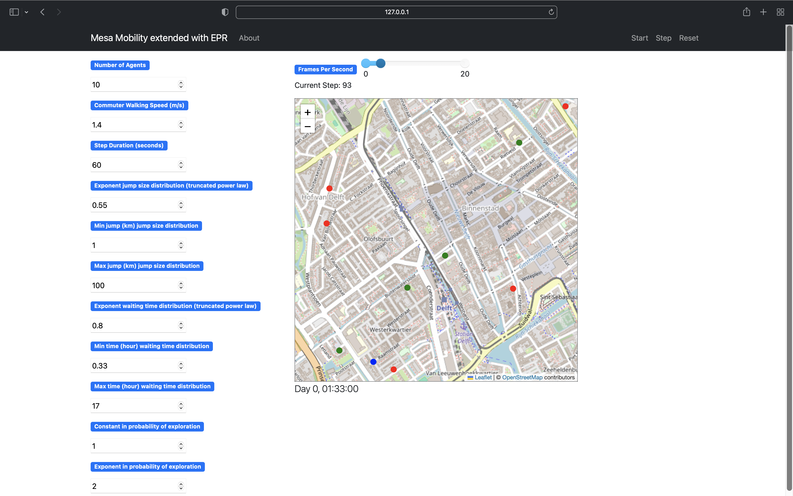

Trajectory and Connecting Cell Model
=========================




## Summary

This is an implementation is based on the [GMU-Social Model](https://github.com/abmgis/abmgis/blob/master/Chapter08-Networks/Models/GMU-Social/README.md) in Python, using [Mesa](https://github.com/projectmesa/mesa) and [Mesa-Geo](https://github.com/projectmesa/mesa-geo). It is built upon the agents and networks example [Agent and Networks](https://github.com/projectmesa/mesa-examples/tree/main/gis/agents_and_networks).

### Trajectory
In this model, we generate mobility trajectories using EPR. All parameters can be chosen through the user interface and correspond to the truncated power law distributions modeling jump length and waiting time in the CTRW. The exploration and preferential return probabilities can also be specified. Agents' commute routes can be found as the shortest path between entrances of their home and desired destination. These commute routes are segmented according to agents' walking speed. In this way, the movements of agents are constrained on the road network.


### Connecting antennas
We include a model to generate datasets for connecting antennas for two phones per agent trajectory. Two options are implemented, one based on the closest antenna facing the agent (the simple model) and one using a coverage model of an antenna's service area (the coverage model). We assume independent phone usage between phones carried by the same agent, and model inter-arrival times as exponentially distributed with the rate of one per hour. We also allow for a dependency sampling option based on either time or location.


## How to set file locations
Update config.py to include the correct file locations.
Street and building locations (in the netherlands) can be downloaded from https://download.geofabrik.de/europe/netherlands.html. 

## How to run
From the agents_and_networks folder, first install the dependencies:

```bash
python3 -m pip install -r requirements.txt
```

Then run the trajectory model:

```bash
python3 scripts/run.py 
```

Then run the cell-tower sampling model:


With coverage model:
```bash
python3 scripts/run_cell/coverage.py 
```

With simple sampling (closest cell tower facing agent):
```bash
python3 scripts/run_cell/simple.py 
```

Open your browser to [http://127.0.0.1:8521/](http://127.0.0.1:8521/) and press `Start`.


## License

The data is from the [GMU-Social Model](https://github.com/abmgis/abmgis/blob/master/Chapter08-Networks/Models/GMU-Social/README.md) and is licensed under the [Creative Commons Attribution-ShareAlike 4.0 International License](https://creativecommons.org/licenses/by-sa/4.0/).
